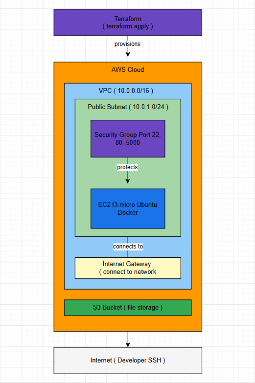

# TerraStack

Automated AWS infrastructure provisioning using Terraform (Infrastructure as Code).
Replace manual AWS Console setup with a single command.

## What Gets Created

- VPC (private network)
- Public Subnet
- Internet Gateway
- Route Table
- Security Group (SSH, HTTP, port 5000)
- EC2 Instance (Ubuntu 22.04 with Docker pre-installed)
- S3 Bucket (file storage)

## Quick Start

```bash
terraform init
terraform plan
terraform apply
```

## Tear Down (Avoid AWS Charges)

Always destroy resources when not in use to avoid unexpected charges:

```bash
terraform destroy
```

## Tech Stack

- Terraform
- AWS VPC
- AWS EC2
- AWS S3
- AWS IAM

## Architecture


